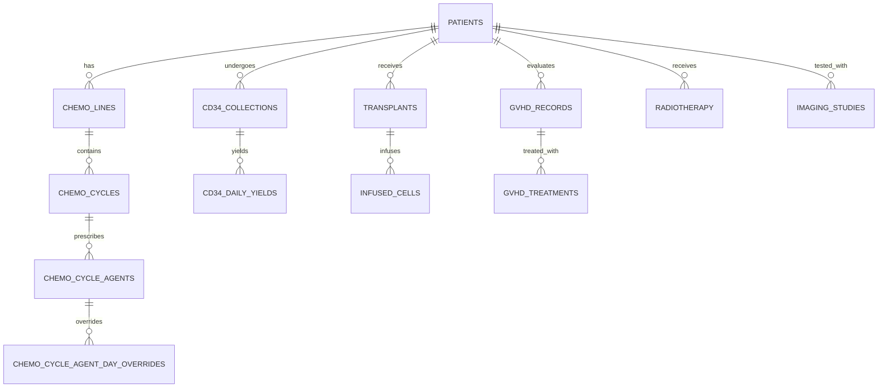

# Eunpyeong St. Mary's Myeloma Center Database Schema
> **Version**: 2.0  
> **Target System**: HemaCDS 2.0 - Eunpyeong St. Mary's Hospital Multiple Myeloma Database  
> **Generated Date**: 2026-08-22  
> **Source Files Analyzed**:
> - `Add_New_Patient.html`
> - `Baseline_Charateristics.html`
> - `Edit_Patient.html`
> - `Chemotherapy.html`
> - `CD34+_Collection.html`
> - `Transplant.html`
> - `GVHD.html`
> - `Radiotherapy.html`
> - `Imaging.html`
> - `Dashboard.html`

---

## 1. 개요 및 ERD (Entity Relationship Diagram)

다발골수종 환자의 진단 시점 기본 인구통계학적 특성, 혈액학/생화학/면역글로불린/유전체 검사부터 항암화학요법(치료 차수 및 사이클), 조혈모세포 가동화 및 채집, 조혈모세포이식, 이식편대숙주질환(GVHD), 방사선치료, 다중 영상의학검사까지의 전주기 임상 데이터를 통합 관리하는 정규화된 관계형 데이터베이스 스키마입니다.



---

## 2. 테이블 상세 정의서 (Table Specifications)

### 2.1 환자 기본 정보 및 진단/병기 (`patients`)
환자의 고유 등록번호(UPN)를 Primary Key로 하며, 진단 시점의 인구통계학 정보, CRAB 징후, 혈액화학 및 면역글로불린 수치, 골수/염색체 검사, 간염/HIV 바이러스 마커, 종합 병기(DS, ISS, R-ISS, R2-ISS)를 저장합니다.

| 필드명 (Column Name) | 데이터 타입 | Nullable | 기본값 | 설명 및 UI 매핑 |
| :--- | :--- | :---: | :--- | :--- |
| **`upn`** | VARCHAR(20) | **PK** | - | 환자 등록번호 (ID) |
| `name` | VARCHAR(50) | NN | - | 환자 성명 |
| `date_birth` | DATE | Y | - | 생년월일 |
| `sex` | VARCHAR(10) | Y | - | 성별 (`Male`, `Female`) |
| `height_dx` | REAL | Y | - | 진단 시 신장 (cm) |
| `bwt_dx` | REAL | Y | - | 진단 시 체중 (kg) |
| `ecog_dx` | INTEGER | Y | - | ECOG 수행능력 (0~5) |
| `vital_status` | VARCHAR(20) | Y | 'Alive' | 생존 상태 (`Alive`, `Deceased`) |
| `date_last_followup` | DATE | Y | - | 최종 추적관찰일 |
| `date_death` | DATE | Y | - | 사망일자 |
| `date_dx` | DATE | Y | - | 다발골수종 진단일자 |
| `dp_dx` | VARCHAR(100) | Y | - | 질환 분류 (MGUS, MGCS, Smoldering, Symptomatic, PCL 등) |
| `mgcs_type` | VARCHAR(50) | Y | - | MGCS 세부유형 (Renal, Nervous, Cutaneous, Ocular, Others) |
| `mgcs_specify` | VARCHAR(100) | Y | - | MGCS 기타 상세 설명 |
| `amyloidosis_yn` | VARCHAR(5) | Y | 'No' | 동반 아밀로이드증 여부 (`Yes`, `No`) |
| `amyloidosis_organs` | TEXT | Y | - | 아밀로이드증 침범 장기 (Renal, Cardiac, Neurologic 등) |
| `hyperca_dx` | VARCHAR(5) | Y | - | CRAB - Hypercalcemia (`+`, `-`) |
| `renal_dx` | VARCHAR(5) | Y | - | CRAB - Renal insufficiency (`+`, `-`) |
| `anemia_dx` | VARCHAR(5) | Y | - | CRAB - Anemia (`+`, `-`) |
| `osetlytic_dx` | VARCHAR(5) | Y | - | CRAB - Bone lesions (`+`, `-`) |
| `lytic_lesions_dx` | VARCHAR(10) | Y | - | 용해성 골병변 개수 (`1`, `≥ 2`) |
| `paraskeletal_dx` | VARCHAR(5) | Y | 'No' | 골주위 병변 (Paraskeletal Disease: `Yes`, `No`) |
| `emd_dx` | VARCHAR(5) | Y | 'No' | 골수외 병변 (Extramedullary Disease: `Yes`, `No`) |
| `hg_dx` | REAL | Y | - | Hemoglobin (g/dL) |
| `b2mg_dx` | REAL | Y | - | β2 microglobulin (mg/L) |
| `bun_dx` | REAL | Y | - | BUN (mg/dL) |
| `cr_dx` | REAL | Y | - | Creatinine (mg/dL) |
| `tp_dx` | REAL | Y | - | Total Protein (g/dL) |
| `alb_dx` | REAL | Y | - | Albumin (g/dL) |
| `tb_dx` | REAL | Y | - | Total Bilirubin (mg/dL) |
| `ast_dx` | REAL | Y | - | AST (U/L) |
| `alt_dx` | REAL | Y | - | ALT (U/L) |
| `ca_dx` | REAL | Y | - | Calcium (mg/dL) |
| `ldh_dx` | REAL | Y | - | LDH (U/L) |
| `chain_heavy` | VARCHAR(20) | Y | - | Heavy chain (`IgG`, `IgA`, `IgM`, `IgD`, `IgE`, `Negative`) |
| `chain_light` | VARCHAR(20) | Y | - | Light chain (`kappa`, `lambda`, `Negative`) |
| `ig_g_dx` | REAL | Y | - | Serum IgG (mg/dL) |
| `ig_a_dx` | REAL | Y | - | Serum IgA (mg/dL) |
| `ig_m_dx` | REAL | Y | - | Serum IgM (mg/dL) |
| `ig_d_dx` | REAL | Y | - | Serum IgD (mg/dL) |
| `ig_e_dx` | REAL | Y | - | Serum IgE (IU/mL) |
| `kappa_dx` | REAL | Y | - | Serum Free Kappa (mg/L) |
| `lambda_dx` | REAL | Y | - | Serum Free Lambda (mg/L) |
| `serum_m_dx` | REAL | Y | - | Serum PEP/IEP M-protein (g/dL) |
| `urine_m_dx` | REAL | Y | - | Urine PEP/IEP 24hr M-protein (mg/day) |
| `cellularity_dx` | REAL | Y | - | 골수 세포 충실도 (Cellularity, %) |
| `plasma_cell_dx` | REAL | Y | - | 골수 형질세포 비율 (Plasma cell, %) |
| `cytogenetics_dx` | VARCHAR(255) | Y | - | 핵형 분석 (e.g. 46,XY[20]) |
| `igh_fgfr3_dx` | REAL | Y | - | t(4;14) IGH::FGFR3 (%) |
| `igh_ccnd1_dx` | REAL | Y | - | t(11;14) IGH::CCND1 (%) |
| `igh_maf_dx` | REAL | Y | - | t(14;16) IGH::MAF (%) |
| `igh_mafb_dx` | REAL | Y | - | t(14;20) IGH::MAFB (%) |
| `tp53_dx` | REAL | Y | - | del(17p13) TP53 (%) |
| `cks1b_dx` | REAL | Y | - | gain(1q21) CKS1B (%) |
| `rb1_dx` | REAL | Y | - | del(13q14) RB1 (%) |
| `cdkn2c_dx` | REAL | Y | - | del(1p32) CDKN2C (%) |
| `hbsag_dx` | VARCHAR(5) | Y | - | HBs Ag (`+`, `-`) |
| `hbsab_dx` | VARCHAR(5) | Y | - | HBs Ab (`+`, `-`) |
| `hbcab_dx` | VARCHAR(5) | Y | - | HBc Ab IgG (`+`, `-`) |
| `anti_hcv_dx` | VARCHAR(5) | Y | - | Anti-HCV Ab (`+`, `-`) |
| `hiv_dx` | VARCHAR(5) | Y | - | HIV Ag/Ab (`+`, `-`) |
| `stage_ds` | VARCHAR(10) | Y | - | Durie-Salmon 병기 (`IA`, `IB`, `IIA`, `IIB`, `IIIA`, `IIIB`) |
| `stage_iss` | VARCHAR(10) | Y | - | ISS 병기 (`I`, `II`, `III`) |
| `stage_riss` | VARCHAR(10) | Y | - | R-ISS 병기 (`I`, `II`, `III`) |
| `stage_r2iss` | VARCHAR(10) | Y | - | R2-ISS 병기 (`I`, `II`, `III`, `IV`) |
| `created_at` | TIMESTAMP | Y | CURRENT_TIMESTAMP | 레코드 생성 일시 |
| `updated_at` | TIMESTAMP | Y | CURRENT_TIMESTAMP | 레코드 수정 일시 |

---

### 2.2 항암화학요법 (`chemo_lines`, `chemo_cycles`, `chemo_cycle_agents`, `chemo_cycle_agent_day_overrides`)
> **2026-09-19 갱신**: 현재의 `Chemotherapy.html` + `app.js` 구현(사이드바 Line/Regimen/Cycles + Response·Progression·EOT 뷰)에 맞춰 아래 두 테이블을 동기화했습니다. `chemo_lines`에는 화면의 "Reason for cessation = Others" 자유입력 필드(`custom_cessation_reason`)를 추가했고, `chemo_cycles`에서는 현재 화면에 존재하지 않는 사이클별 검사수치(WBC/ANC/Hemoglobin 등) 컬럼을 제거했습니다 — 사이클 카드에는 시작일과 주기(일수)만 입력하며, 검사수치 입력 UI는 아직 구현되어 있지 않습니다.

#### 1) `chemo_lines` (치료 차수 및 전체 반응/종료 평가)
| 필드명 | 데이터 타입 | Nullable | 기본값 | 설명 |
| :--- | :--- | :---: | :--- | :--- |
| **`line_id`** | INTEGER | **PK** | - | 치료 라인 고유 ID (Auto Increment) |
| **`upn`** | VARCHAR(20) | **FK** | - | 환자 등록번호 (`patients.upn`) |
| `line_number` | VARCHAR(30) | Y | - | 치료 차수 (`First`, `Consolidation`, `Maintenance`, `Second` ~ `Twelfth`) |
| `regimen` | VARCHAR(100) | Y | - | 표준 항암 요법명 (레지멘 프리셋 JSON에서 로드, `Others` 포함) |
| `custom_regimen` | VARCHAR(100) | Y | - | `regimen`이 `Others`일 때 직접 입력된 요법명 (e.g. VRd, D-Rd) |
| `date_first_response` | DATE | Y | - | 최초 반응 평가일 |
| `depth_first_response` | VARCHAR(20) | Y | 'SD' | 최초 반응 깊이 (`sCR`, `CR`, `VGPR`, `PR`, `MR`, `SD`, `PD`, `NE`) |
| `date_best_response` | DATE | Y | - | 최적 반응 평가일 |
| `depth_best_response` | VARCHAR(20) | Y | 'SD' | 최적 반응 깊이 (`sCR`, `CR`, `VGPR`, `PR`, `MR`, `SD`, `PD`, `NE`) |
| `disease_progression` | VARCHAR(5) | Y | 'No' | 질환 진행 여부 (`Yes`, `No`) |
| `date_progression` | DATE | Y | - | 질환 진행일자 (`disease_progression = Yes`일 때만 입력 노출) |
| `end_of_tx_date` | DATE | Y | - | 치료 종료일자 |
| `cessation_reason` | VARCHAR(100) | Y | 'Completed' | 치료 중단 사유 (`Completed`, `Disease progression`, `Toxicity / Side effects`, `Patient refusal`, `Death`, `Others`) |
| `custom_cessation_reason` | VARCHAR(200) | Y | - | `cessation_reason`이 `Others`일 때 직접 입력한 사유 |
| `progression_type` | VARCHAR(30) | Y | - | 진행 양상 (`cessation_reason = Disease progression`일 때만 입력 노출: `Biochemical`, `Clinical`, `both`) |
| `toxicity_specify` | VARCHAR(200) | Y | - | 독성/부작용 상세 기술 (`cessation_reason = Toxicity / Side effects`일 때만 입력 노출) |
| `toxicity_grade` | VARCHAR(10) | Y | - | 독성 등급 (`cessation_reason = Toxicity / Side effects`일 때만 입력 노출: `I`, `II`, `III`, `IV`, `V`) |
| `refractory_agents` | TEXT | Y | - | "Refractory Status for Used Agents" 목록 (JSON, `{ 약제명: 'Yes' \| 'No' }`). 해당 라인의 모든 사이클에서 실제 선택된 약제 중 Dexamethasone을 제외한 약제들이 대상 |

#### 2) `chemo_cycles` (사이클 메타데이터)
| 필드명 | 데이터 타입 | Nullable | 설명 |
| :--- | :--- | :---: | :--- |
| **`cycle_id`** | INTEGER | **PK** | 사이클 고유 ID |
| **`line_id`** | INTEGER | **FK** | 치료 라인 ID (`chemo_lines.line_id`) |
| `cycle_number` | VARCHAR(20) | Y | 사이클 이름/번호 (e.g. `Cycle 1`, `Cycle 2`; 사이드바에서 `3-5`, `8-` 같은 범위 입력으로 일괄 생성 가능) |
| `start_date` | DATE | Y | 사이클 시작일 |
| `cycle_length_days` | INTEGER | Y | 사이클 주기 (일수, 기본값 28) |

#### 3) `chemo_cycle_agents` (사이클별 투약 약제 및 스케줄)
> 하나의 약제가 한 사이클 내에서 용량이 다른 여러 스케줄로 나뉠 수 있으므로(예: Carfilzomib이 C1에는 20 mg/m², 이후 QWF8 패턴에는 56 mg/m²), 이 테이블의 grain은 "사이클의 약제 1건"이 아니라 **"사이클 내 하나의 투약 스케줄(schedule) 1건"**입니다. 같은 `cycle_id` + `agent_name` 조합이 여러 행으로 존재할 수 있습니다. `dose`/`dosing_days`는 Chemotherapy 화면의 프리셋 라디오 선택값과 "Others" 직접입력값을 구분하지 않고, 화면에 실제로 표시되는 최종 텍스트를 그대로 저장합니다(예: 프리셋 코드 `QW4` 또는 직접입력한 자유 텍스트가 그대로 들어감).

| 필드명 | 데이터 타입 | Nullable | 설명 |
| :--- | :--- | :---: | :--- |
| **`cycle_agent_id`** | INTEGER | **PK** | 처방 스케줄 고유 ID |
| **`cycle_id`** | INTEGER | **FK** | 사이클 ID (`chemo_cycles.cycle_id`) |
| `agent_class` | VARCHAR(50) | Y | 약제 분류 (IMiDs, Proteasome inhibitors, Anti-CD38, Alkylators, Steroids 등) |
| `agent_name` | VARCHAR(100) | Y | 약제명 (Bortezomib, Lenalidomide, Daratumumab, Dexamethasone 등). "Others"로 직접 입력한 경우 입력한 약제명 그대로 저장 |
| `dose` | VARCHAR(50) | Y | 처방 용량 (e.g. 1.3 mg/m², 25 mg, 40 mg) |
| `dosing_days` | VARCHAR(100) | Y | 투여 일자 프리셋 코드 또는 자유 텍스트 (e.g. `QW4`, `D1,4,8,11`) |
| `schedule_order` | INTEGER | Y | 같은 약제가 여러 스케줄로 나뉠 때의 표시 순서 (Schedule 1, Schedule 2 …) |

---

#### 4) `chemo_cycle_agent_day_overrides` (캘린더 화면에서 개별 투약일 단위로 적용한 예외)
> "5. Treatment Schedule" 캘린더에서 특정 날짜의 투약 항목만 마우스로 삭제하거나 다른 날짜로 옮기거나 용량을 수정했을 때 생기는 예외를 저장합니다. `chemo_cycle_agents`의 `dosing_days` 패턴을 펼쳐서 나오는 날짜(`origin_day`) 중 예외가 있는 날짜만 이 테이블에 행이 존재하며, 예외가 없는 날짜는 기존 패턴 그대로 표시됩니다. `(cycle_agent_id, origin_day)` 조합은 유일합니다.

| 필드명 | 데이터 타입 | Nullable | 설명 |
| :--- | :--- | :---: | :--- |
| **`override_id`** | INTEGER | **PK** | 예외 항목 고유 ID |
| **`cycle_agent_id`** | INTEGER | **FK** | 대상 스케줄 ID (`chemo_cycle_agents.cycle_agent_id`) |
| `origin_day` | INTEGER | NN | 원래 패턴상의 투약일차 (사이클 시작일 기준 D-number) |
| `is_deleted` | BOOLEAN | Y | 해당 투약일을 캘린더에서 삭제했는지 여부 (기본값 `0`) |
| `moved_to_day` | INTEGER | Y | 다른 날짜로 옮긴 경우 이동한 목적지 일차. 이동하지 않았으면 NULL |
| `override_dose` | VARCHAR(50) | Y | 이 투약일에만 적용되는 용량. 스케줄 기본 용량과 다르게 수정한 경우에만 값이 들어감 |

---

### 2.3 조혈모세포 가동화 및 채집 (`cd34_collections`, `cd34_daily_yields`)

#### 1) `cd34_collections` (가동화 요법 및 누적 채집 성적)
| 필드명 | 데이터 타입 | Nullable | 설명 |
| :--- | :--- | :---: | :--- |
| **`collection_id`** | INTEGER | **PK** | 채집 고유 ID |
| **`upn`** | VARCHAR(20) | **FK** | 환자 등록번호 (`patients.upn`) |
| `gcsf_type` | VARCHAR(50) | Y | G-CSF 종류 (`Filgrastim`, `Lenograstim`, `Pegfilgrastim`, `Others`) |
| `gcsf_dose` | VARCHAR(50) | Y | G-CSF 용량 (e.g. `10 mcg/kg`) |
| `gcsf_duration` | INTEGER | Y | G-CSF 투여 일수 |
| `gcsf_start_date` | DATE | Y | G-CSF 시작일자 |
| `chemo_mobilization`| TEXT | Y | 병용 항암 가동화 요법 리스트 (JSON) |
| `start_date` | DATE | Y | 성분채집(Apheresis) 시작일자 |
| `apheresis_days` | INTEGER | Y | 총 채집 일수 (1~5일) |
| `cell_viability` | REAL | Y | 세포 생존율 (%) |
| `total_cd34_yield` | REAL | Y | 총 CD34+ 채집 수율 (×10⁶/kg) |
| `total_tnc_yield` | REAL | Y | 총 TNC 채집 수율 (×10⁸/kg) |
| `total_bags` | INTEGER | Y | 총 동결 보관 백(Bag) 수 |

#### 2) `cd34_daily_yields` (일차별 채집 성적)
| 필드명 | 데이터 타입 | Nullable | 설명 |
| :--- | :--- | :---: | :--- |
| **`yield_id`** | INTEGER | **PK** | 일별 수율 고유 ID |
| **`collection_id`** | INTEGER | **FK** | 채집 ID (`cd34_collections.collection_id`) |
| `day_number` | INTEGER | Y | 채집 일차 (1, 2, 3, 4, 5) |
| `collection_date` | DATE | Y | 해당 일차 채집일 |
| `cd34_yield` | REAL | Y | 당일 CD34+ 채집량 (×10⁶/kg) |
| `tnc_yield` | REAL | Y | 당일 TNC 채집량 (×10⁸/kg) |
| `bags_count` | INTEGER | Y | 당일 채집 백 수 |

---

### 2.4 조혈모세포이식 (`transplant_records`, `transplant_infused_cells`)

#### 1) `transplant_records` (이식 기본 정보 및 전처지/예방/지지요법)
| 필드명 | 데이터 타입 | Nullable | 설명 |
| :--- | :--- | :---: | :--- |
| **`transplant_id`** | INTEGER | **PK** | 이식 고유 ID |
| **`upn`** | VARCHAR(20) | **FK** | 환자 등록번호 (`patients.upn`) |
| `transplant_order` | VARCHAR(30) | Y | 이식 차수 (`1st`, `2nd (Tandem)`, `2nd (Salvage)`, `3rd`, `Others`) |
| `transplant_type` | VARCHAR(30) | Y | 이식 종류 (`Autologous`, `Allogeneic`) |
| `donor_type` | VARCHAR(50) | Y | 공여자 구분 (`N/A`, `Sibling`, `Unrelated`, `Haploidentical`, `Others`) |
| `cell_source` | VARCHAR(50) | Y | 조혈모세포원 (`PBSC`, `Bone marrow`, `Cord blood`, `Others`) |
| `donor_age` | INTEGER | Y | 동종 공여자 나이 |
| `donor_sex` | VARCHAR(10) | Y | 동종 공여자 성별 (`Male`, `Female`) |
| `donor_weight` | REAL | Y | 동종 공여자 체중 (kg) |
| `hla_match` | VARCHAR(30) | Y | HLA 일치도 (`8/8`, `7/8`, `6/8`, `4/8 (Haplo)`, `Others`) |
| `abo_match` | VARCHAR(50) | Y | ABO 혈액형 일치도 (`Compatible`, `Major mismatch`, `Minor mismatch`, `Bidirectional`) |
| `conditioning_regimen` | TEXT | Y | 전처지요법 약제/용량 구성 (JSON) |
| `gvhd_prophylaxis` | TEXT | Y | GVHD 예방요법 약제 구성 (JSON) |
| `gcsf_dose` | VARCHAR(50) | Y | 이식 후 G-CSF 용량 (`5 mcg/kg`, `10 mcg/kg`, `None` 등) |
| `gcsf_start_day` | VARCHAR(30) | Y | G-CSF 투여 시작일차 (`From D+5`, `From D+7`, `Others`) |
| `ivig_dose` | VARCHAR(50) | Y | IVIG 투여 용량 (`500 mg/kg`, `None`, `Others`) |
| `ivig_infusion_day` | VARCHAR(30) | Y | IVIG 투여일차 (`D+7`, `Others`) |

#### 2) `transplant_infused_cells` (주입 세포 성적)
| 필드명 | 데이터 타입 | Nullable | 설명 |
| :--- | :--- | :---: | :--- |
| **`infused_id`** | INTEGER | **PK** | 주입 성적 고유 ID |
| **`transplant_id`** | INTEGER | **FK** | 이식 ID (`transplant_records.transplant_id`) |
| `infusion_day_label` | VARCHAR(20) | Y | 주입 일차 레이블 (`D0`, `D+1` 등) |
| `infusion_date` | DATE | Y | 세포 주입일자 |
| `infused_volume` | REAL | Y | 주입 용량 (mL) |
| `infused_viability` | REAL | Y | 주입 세포 생존율 (%) |
| `infused_cd34` | REAL | Y | 주입 CD34+ 세포수 (×10⁶/kg) |
| `infused_tnc` | REAL | Y | 주입 TNC 세포수 (×10⁸/kg) |
| `infused_mnc` | REAL | Y | 주입 MNC 세포수 (×10⁸/kg) |

---

### 2.5 이식편대숙주질환 (`gvhd_assessments`, `gvhd_treatments`)

#### 1) `gvhd_assessments` (급성/만성 GVHD 평가)
| 필드명 | 데이터 타입 | Nullable | 설명 |
| :--- | :--- | :---: | :--- |
| **`gvhd_id`** | INTEGER | **PK** | GVHD 평가 고유 ID |
| **`upn`** | VARCHAR(20) | **FK** | 환자 등록번호 (`patients.upn`) |
| `transplant_id` | INTEGER | **FK** | 관련 이식 ID (`transplant_records.transplant_id`) |
| `agvhd_status` | VARCHAR(20) | Y | 급성 GVHD 발생 여부 (`No`, `Yes`, `Competing`) |
| `agvhd_max_grade` | VARCHAR(20) | Y | 급성 최고 등급 (`I`, `II`, `III`, `IV`, `None`) |
| `agvhd_onset_date` | DATE | Y | 급성 GVHD 발병일자 |
| `agvhd_skin_stage` | VARCHAR(10) | Y | 피부 병기 (`0` ~ `4`) |
| `agvhd_liver_stage` | VARCHAR(10) | Y | 간 병기 (`0` ~ `4`) |
| `agvhd_gi_stage` | VARCHAR(10) | Y | 위장관 병기 (`0` ~ `4`) |
| `cgvhd_status` | VARCHAR(20) | Y | 만성 GVHD 발생 여부 (`No`, `Yes`, `Competing`) |
| `cgvhd_severity` | VARCHAR(20) | Y | 만성 중증도 (`Mild`, `Moderate`, `Severe`, `None`) |
| `cgvhd_onset_date` | DATE | Y | 만성 GVHD 발병일자 |
| `cgvhd_skin_score` | INTEGER | Y | 피부 점수 (Skin Score) (`None`, `Mild`, `Moderate`, `Severe`) |
| `cgvhd_mouth_score` | INTEGER | Y | 구강 점수 (Mouth Score) (`None`, `Mild`, `Moderate`, `Severe`) |
| `cgvhd_eyes_score` | INTEGER | Y | 안구 점수 (Eyes Score) (`None`, `Mild`, `Moderate`, `Severe`) |
| `cgvhd_lungs_score` | VARCHAR(20) | Y | 폐 점수 (Lungs Score) (`None`, `Mild`, `Moderate`, `Severe`) |
| `cgvhd_musculoskeletal_score` | VARCHAR(20) | Y | 근골격계 점수 (Musculoskeletal Score) (`None`, `Mild`, `Moderate`, `Severe`) |

#### 2) `gvhd_treatments` (GVHD 전신 치료 이력)
| 필드명 | 데이터 타입 | Nullable | 설명 |
| :--- | :--- | :---: | :--- |
| **`treatment_id`** | INTEGER | **PK** | 치료 고유 ID |
| **`gvhd_id`** | INTEGER | **FK** | GVHD 평가 ID (`gvhd_assessments.gvhd_id`) |
| `treatment_line` | VARCHAR(30) | Y | 치료 차수 (`1st`, `2nd`, `3rd`, `4th`, `Others`) |
| `agent_name` | VARCHAR(100) | Y | 치료 약제 (`Steroid`, `ECP`, `Ruxolitinib`, `Ibrutinib`, `Belumosudil` 등) |
| `agent_specify` | VARCHAR(100) | Y | 기타 약제 상세 |
| `start_date` | DATE | Y | 치료 시작일자 |
| `best_response` | VARCHAR(30) | Y | 치료 반응 (`CR`, `PR`, `NR`, `Ongoing`, `Others`) |

---

### 2.6 방사선 치료 (`radiotherapy_records`)

| 필드명 | 데이터 타입 | Nullable | 설명 |
| :--- | :--- | :---: | :--- |
| **`rt_id`** | INTEGER | **PK** | 방사선치료 고유 ID |
| **`upn`** | VARCHAR(20) | **FK** | 환자 등록번호 (`patients.upn`) |
| `modality` | VARCHAR(50) | Y | 치료 기법 (`3D-CRT`, `IMRT`, `VMAT`, `IGRT`, `SBRT`, `Others`) |
| `modality_specify` | VARCHAR(100) | Y | 기타 치료 기법 상세 |
| `dose_gy` | REAL | Y | 총 조사 선량 (Gy) |
| `fractions_fxs` | INTEGER | Y | 분할 횟수 (Fractions) |
| `start_date` | DATE | Y | 방사선치료 시작일자 |
| `site_category` | VARCHAR(50) | Y | 조사 부위 (`Spine`, `Ribs`, `Pelvis`, `Femur`, `Humerus`, `Others`) |
| `site_detail_spine` | VARCHAR(100) | Y | 척추 상세 위치 (e.g. `T3`, `T8-9`, `L1, 4, 5`) |
| `site_detail_ribs` | VARCHAR(50) | Y | 늑골 상세 위치 (e.g. `Rt. 7th`) |
| `site_side` | VARCHAR(20) | Y | 좌우 구분 (`Rt.`, `Lt.`, `Both`) |
| `site_others` | VARCHAR(100) | Y | 기타 부위 상세 (e.g. `Clavicle, Rt.`) |

---

### 2.7 영상의학 검사 (`imaging_studies`)

| 필드명 | 데이터 타입 | Nullable | 설명 |
| :--- | :--- | :---: | :--- |
| **`study_id`** | INTEGER | **PK** | 영상 검사 고유 ID |
| **`upn`** | VARCHAR(20) | **FK** | 환자 등록번호 (`patients.upn`) |
| `modality_type` | VARCHAR(50) | NN | 검사 구분 (`Conventional Skeletal Survey`, `18F-FDG PET/CT`, `MRI`, `Low-dose whole-body CT`, `Other Imaging Studies`) |
| `study_date` | DATE | Y | 검사 시행일자 |
| `is_not_done` | BOOLEAN | Y | 검사 미시행 여부 (0: 시행, 1: 미시행) |
| `sub_type` | VARCHAR(50) | Y | 세부 유형 (PET/CT: `Torso`/`Whole body`, MRI: `Axial`/`Whole-body`) |
| `dwi_performed` | BOOLEAN | Y | MRI DWI 촬영 여부 |
| `interpretation` | TEXT | Y | 판독 소견 전문 (Interpretation) |
| `osteolytic_yn` | VARCHAR(5) | Y | 용해성 병변(Osteolytic lesions) 유무 (`yes`, `no`) |
| `osteo_spine_levels` | VARCHAR(100) | Y | 용해성 병변 - 척추 레벨 |
| `osteo_ribs_side` | VARCHAR(20) | Y | 용해성 병변 - 늑골 위치 (`Rt.`, `Lt.`, `Both`) |
| `osteo_skull` | BOOLEAN | Y | 용해성 병변 - 두개골 침범 여부 |
| `osteo_pelvis_side` | VARCHAR(20) | Y | 용해성 병변 - 골반 위치 (`Rt.`, `Lt.`, `Both`) |
| `osteo_femur_side` | VARCHAR(20) | Y | 용해성 병변 - 대퇴골 위치 (`Rt.`, `Lt.`, `Both`) |
| `osteo_humerus_side`| VARCHAR(20) | Y | 용해성 병변 - 상완골 위치 (`Rt.`, `Lt.`, `Both`) |
| `osteo_others` | VARCHAR(150) | Y | 용해성 병변 - 기타 부위 |
| `fractures_yn` | VARCHAR(5) | Y | 골절(Fractures) 유무 (`yes`, `no`) |
| `frac_spine_levels` | VARCHAR(100) | Y | 골절 - 척추 레벨 |
| `frac_ribs_side` | VARCHAR(20) | Y | 골절 - 늑골 위치 (`Rt.`, `Lt.`, `Both`) |
| `frac_skull` | BOOLEAN | Y | 골절 - 두개골 골절 여부 |
| `frac_pelvis_side` | VARCHAR(20) | Y | 골절 - 골반 위치 (`Rt.`, `Lt.`, `Both`) |
| `frac_femur_side` | VARCHAR(20) | Y | 골절 - 대퇴골 위치 (`Rt.`, `Lt.`, `Both`) |
| `frac_humerus_side` | VARCHAR(20) | Y | 골절 - 상완골 위치 (`Rt.`, `Lt.`, `Both`) |
| `frac_others` | VARCHAR(150) | Y | 골절 - 기타 부위 |
| `focal_lesions_yn` | VARCHAR(5) | Y | MRI 국소 병변(Focal lesions) 유무 (`yes`, `no`) |
| `focal_lesions_count`| INTEGER | Y | MRI 국소 병변 개수 |
| `dicom_path` | VARCHAR(255) | Y | 업로드된 DICOM 파일 경로 또는 식별자 |

---

## 3. SQLite DDL 생성 스크립트

```sql
-- ==========================================================
-- Eunpyeong St. Mary's Myeloma Center Database DDL
-- ==========================================================

-- 1. 환자 마스터 테이블
CREATE TABLE IF NOT EXISTS patients (
    upn VARCHAR(20) PRIMARY KEY,
    name VARCHAR(50) NOT NULL,
    date_birth DATE,
    sex VARCHAR(10) CHECK (sex IN ('Male', 'Female')),
    height_dx REAL,
    bwt_dx REAL,
    ecog_dx INTEGER,
    vital_status VARCHAR(20) DEFAULT 'Alive',
    date_last_followup DATE,
    date_death DATE,
    date_dx DATE,
    dp_dx VARCHAR(100),
    mgcs_type VARCHAR(50),
    mgcs_specify VARCHAR(100),
    amyloidosis_yn VARCHAR(5) DEFAULT 'No',
    amyloidosis_organs TEXT,
    hyperca_dx VARCHAR(5),
    renal_dx VARCHAR(5),
    anemia_dx VARCHAR(5),
    osetlytic_dx VARCHAR(5),
    lytic_lesions_dx VARCHAR(10),
    paraskeletal_dx VARCHAR(5) DEFAULT 'No',
    emd_dx VARCHAR(5) DEFAULT 'No',
    hg_dx REAL,
    b2mg_dx REAL,
    bun_dx REAL,
    cr_dx REAL,
    tp_dx REAL,
    alb_dx REAL,
    tb_dx REAL,
    ast_dx REAL,
    alt_dx REAL,
    ca_dx REAL,
    ldh_dx REAL,
    chain_heavy VARCHAR(20),
    chain_light VARCHAR(20),
    ig_g_dx REAL,
    ig_a_dx REAL,
    ig_m_dx REAL,
    ig_d_dx REAL,
    ig_e_dx REAL,
    kappa_dx REAL,
    lambda_dx REAL,
    serum_m_dx REAL,
    urine_m_dx REAL,
    cellularity_dx REAL,
    plasma_cell_dx REAL,
    cytogenetics_dx VARCHAR(255),
    igh_fgfr3_dx REAL,
    igh_ccnd1_dx REAL,
    igh_maf_dx REAL,
    igh_mafb_dx REAL,
    tp53_dx REAL,
    cks1b_dx REAL,
    rb1_dx REAL,
    cdkn2c_dx REAL,
    hbsag_dx VARCHAR(5),
    hbsab_dx VARCHAR(5),
    hbcab_dx VARCHAR(5),
    anti_hcv_dx VARCHAR(5),
    hiv_dx VARCHAR(5),
    stage_ds VARCHAR(10),
    stage_iss VARCHAR(10),
    stage_riss VARCHAR(10),
    stage_r2iss VARCHAR(10),
    created_at TIMESTAMP DEFAULT CURRENT_TIMESTAMP,
    updated_at TIMESTAMP DEFAULT CURRENT_TIMESTAMP
);

-- 2. 항암화학요법 테이블군
CREATE TABLE IF NOT EXISTS chemo_lines (
    line_id INTEGER PRIMARY KEY AUTOINCREMENT,
    upn VARCHAR(20) NOT NULL,
    line_number VARCHAR(30),
    regimen VARCHAR(100),
    custom_regimen VARCHAR(100),
    date_first_response DATE,
    depth_first_response VARCHAR(20) DEFAULT 'SD',
    date_best_response DATE,
    depth_best_response VARCHAR(20) DEFAULT 'SD',
    disease_progression VARCHAR(5) DEFAULT 'No',
    date_progression DATE,
    end_of_tx_date DATE,
    cessation_reason VARCHAR(100) DEFAULT 'Completed',
    custom_cessation_reason VARCHAR(200),
    progression_type VARCHAR(30),
    toxicity_specify VARCHAR(200),
    toxicity_grade VARCHAR(10),
    refractory_agents TEXT,
    FOREIGN KEY (upn) REFERENCES patients(upn) ON DELETE CASCADE
);

CREATE TABLE IF NOT EXISTS chemo_cycles (
    cycle_id INTEGER PRIMARY KEY AUTOINCREMENT,
    line_id INTEGER NOT NULL,
    cycle_number VARCHAR(20),
    start_date DATE,
    cycle_length_days INTEGER DEFAULT 28,
    FOREIGN KEY (line_id) REFERENCES chemo_lines(line_id) ON DELETE CASCADE
);

CREATE TABLE IF NOT EXISTS chemo_cycle_agents (
    cycle_agent_id INTEGER PRIMARY KEY AUTOINCREMENT,
    cycle_id INTEGER NOT NULL,
    agent_class VARCHAR(50),
    agent_name VARCHAR(100),
    dose VARCHAR(50),
    dosing_days VARCHAR(100),
    schedule_order INTEGER,
    FOREIGN KEY (cycle_id) REFERENCES chemo_cycles(cycle_id) ON DELETE CASCADE
);

CREATE TABLE IF NOT EXISTS chemo_cycle_agent_day_overrides (
    override_id INTEGER PRIMARY KEY AUTOINCREMENT,
    cycle_agent_id INTEGER NOT NULL,
    origin_day INTEGER NOT NULL,
    is_deleted BOOLEAN DEFAULT 0,
    moved_to_day INTEGER,
    override_dose VARCHAR(50),
    UNIQUE (cycle_agent_id, origin_day),
    FOREIGN KEY (cycle_agent_id) REFERENCES chemo_cycle_agents(cycle_agent_id) ON DELETE CASCADE
);

-- 3. 조혈모세포 가동화 및 채집 테이블군
CREATE TABLE IF NOT EXISTS cd34_collections (
    collection_id INTEGER PRIMARY KEY AUTOINCREMENT,
    upn VARCHAR(20) NOT NULL,
    gcsf_type VARCHAR(50),
    gcsf_dose VARCHAR(50),
    gcsf_duration INTEGER,
    gcsf_start_date DATE,
    chemo_mobilization TEXT,
    start_date DATE,
    apheresis_days INTEGER,
    cell_viability REAL,
    total_cd34_yield REAL,
    total_tnc_yield REAL,
    total_bags INTEGER,
    FOREIGN KEY (upn) REFERENCES patients(upn) ON DELETE CASCADE
);

CREATE TABLE IF NOT EXISTS cd34_daily_yields (
    yield_id INTEGER PRIMARY KEY AUTOINCREMENT,
    collection_id INTEGER NOT NULL,
    day_number INTEGER,
    collection_date DATE,
    cd34_yield REAL,
    tnc_yield REAL,
    bags_count INTEGER,
    FOREIGN KEY (collection_id) REFERENCES cd34_collections(collection_id) ON DELETE CASCADE
);

-- 4. 조혈모세포이식 테이블군
CREATE TABLE IF NOT EXISTS transplant_records (
    transplant_id INTEGER PRIMARY KEY AUTOINCREMENT,
    upn VARCHAR(20) NOT NULL,
    transplant_order VARCHAR(30),
    transplant_type VARCHAR(30),
    donor_type VARCHAR(50),
    cell_source VARCHAR(50),
    donor_age INTEGER,
    donor_sex VARCHAR(10),
    donor_weight REAL,
    hla_match VARCHAR(30),
    abo_match VARCHAR(50),
    conditioning_regimen TEXT,
    gvhd_prophylaxis TEXT,
    gcsf_dose VARCHAR(50),
    gcsf_start_day VARCHAR(30),
    ivig_dose VARCHAR(50),
    ivig_infusion_day VARCHAR(30),
    FOREIGN KEY (upn) REFERENCES patients(upn) ON DELETE CASCADE
);

CREATE TABLE IF NOT EXISTS transplant_infused_cells (
    infused_id INTEGER PRIMARY KEY AUTOINCREMENT,
    transplant_id INTEGER NOT NULL,
    infusion_day_label VARCHAR(20),
    infusion_date DATE,
    infused_volume REAL,
    infused_viability REAL,
    infused_cd34 REAL,
    infused_tnc REAL,
    infused_mnc REAL,
    FOREIGN KEY (transplant_id) REFERENCES transplant_records(transplant_id) ON DELETE CASCADE
);

-- 5. GVHD 평가 및 치료 테이블군
CREATE TABLE IF NOT EXISTS gvhd_assessments (
    gvhd_id INTEGER PRIMARY KEY AUTOINCREMENT,
    upn VARCHAR(20) NOT NULL,
    transplant_id INTEGER,
    agvhd_status VARCHAR(20) DEFAULT 'No',
    agvhd_max_grade VARCHAR(20),
    agvhd_onset_date DATE,
    agvhd_skin_stage VARCHAR(10),
    agvhd_liver_stage VARCHAR(10),
    agvhd_gi_stage VARCHAR(10),
    cgvhd_status VARCHAR(20) DEFAULT 'No',
    cgvhd_severity VARCHAR(20),
    cgvhd_onset_date DATE,
    cgvhd_skin_score INTEGER,
    cgvhd_mouth_score INTEGER,
    cgvhd_eyes_score INTEGER,
    cgvhd_lungs_score VARCHAR(20),
    cgvhd_musculoskeletal_score VARCHAR(20),
    FOREIGN KEY (upn) REFERENCES patients(upn) ON DELETE CASCADE,
    FOREIGN KEY (transplant_id) REFERENCES transplant_records(transplant_id) ON DELETE SET NULL
);

CREATE TABLE IF NOT EXISTS gvhd_treatments (
    treatment_id INTEGER PRIMARY KEY AUTOINCREMENT,
    gvhd_id INTEGER NOT NULL,
    treatment_line VARCHAR(30),
    agent_name VARCHAR(100),
    agent_specify VARCHAR(100),
    start_date DATE,
    best_response VARCHAR(30),
    FOREIGN KEY (gvhd_id) REFERENCES gvhd_assessments(gvhd_id) ON DELETE CASCADE
);

-- 6. 방사선치료 테이블
CREATE TABLE IF NOT EXISTS radiotherapy_records (
    rt_id INTEGER PRIMARY KEY AUTOINCREMENT,
    upn VARCHAR(20) NOT NULL,
    modality VARCHAR(50),
    modality_specify VARCHAR(100),
    dose_gy REAL,
    fractions_fxs INTEGER,
    start_date DATE,
    site_category VARCHAR(50),
    site_detail_spine VARCHAR(100),
    site_detail_ribs VARCHAR(50),
    site_side VARCHAR(20),
    site_others VARCHAR(100),
    FOREIGN KEY (upn) REFERENCES patients(upn) ON DELETE CASCADE
);

-- 7. 영상의학 검사 테이블
CREATE TABLE IF NOT EXISTS imaging_studies (
    study_id INTEGER PRIMARY KEY AUTOINCREMENT,
    upn VARCHAR(20) NOT NULL,
    modality_type VARCHAR(50) NOT NULL,
    study_date DATE,
    is_not_done BOOLEAN DEFAULT 0,
    sub_type VARCHAR(50),
    dwi_performed BOOLEAN,
    interpretation TEXT,
    osteolytic_yn VARCHAR(5),
    osteo_spine_levels VARCHAR(100),
    osteo_ribs_side VARCHAR(20),
    osteo_skull BOOLEAN,
    osteo_pelvis_side VARCHAR(20),
    osteo_femur_side VARCHAR(20),
    osteo_humerus_side VARCHAR(20),
    osteo_others VARCHAR(150),
    fractures_yn VARCHAR(5),
    frac_spine_levels VARCHAR(100),
    frac_ribs_side VARCHAR(20),
    frac_skull BOOLEAN,
    frac_pelvis_side VARCHAR(20),
    frac_femur_side VARCHAR(20),
    frac_humerus_side VARCHAR(20),
    frac_others VARCHAR(150),
    focal_lesions_yn VARCHAR(5),
    focal_lesions_count INTEGER,
    dicom_path VARCHAR(255),
    FOREIGN KEY (upn) REFERENCES patients(upn) ON DELETE CASCADE
);
```
